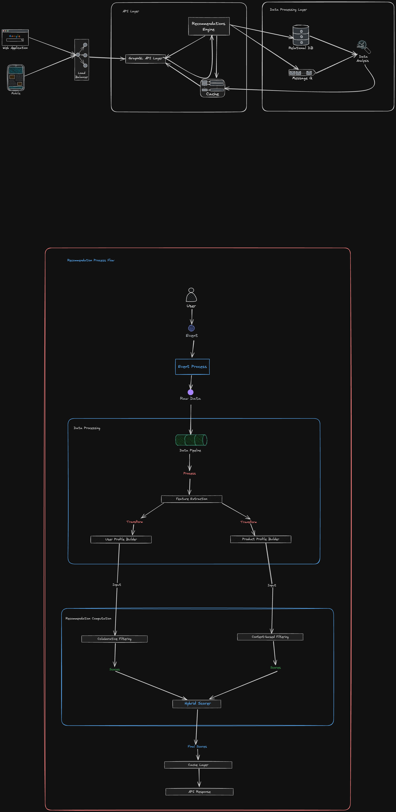

# E-Commerce Recommendation System Documentation

## **Scenario**

Design an API for an e-commerce platform to provide personalized product recommendations based on user behavior and preferences.

### **Requirements**

1. **Store User Interactions**:

   - Capture user interactions such as clicks, purchases, and views.
   - Use this data to generate personalized recommendations.

2. **Endpoints**:

   - **Retrieve Product Recommendations** for a user.
   - **Add/Update User Interaction Data**.

3. **Recommendation Strategies**:

   - **Collaborative Filtering (CF)**: Recommendations based on user similarity and shared preferences.
   - **Content-Based Filtering (CBF)**: Recommendations based on product features (e.g., category, brand, price).

4. **Low-Latency Responses**:

   - Implement caching to ensure fast response times.

5. **Scalability**:

   - Design to handle millions of users and products efficiently.

---

## **Deliverables**

### **1. High-Level Architecture Diagram With low level explanation diagram of Recommendation Engine Below it**

### **2. Recommendation Engine**

#### **Components**

1. **Collaborative Filtering (CF):**

   - Uses user interaction data to find similar users based on shared behaviors.
   - Example: User A and User B both purchased product X; recommend product Y to User A if User B purchased it.

2. **Content-Based Filtering (CBF):**

   - Analyzes product features (e.g., category, brand, price) and user preferences to suggest similar items.
   - Example: If a user purchased a smartphone, recommend accessories or smartphones from the same category or brand.

#### **Data Ingestion**

1. **User Interactions:**

   - Captured via API calls when users interact with products (e.g., clicks, purchases).
   - Stored in the Interaction Database.

2. **Product Features:**

   - Extracted from the Product Database.
   - Used by the Content-Based Filtering engine for similarity analysis.

#### **Processing Flow**

1. Retrieve user interaction data.
2. Use Collaborative Filtering to identify similar users and their preferences.
3. Use Content-Based Filtering to analyze product features and match user preferences.
4. Combine results for a hybrid recommendation strategy.

---

### **3. Caching and Optimization**

#### **Caching Strategy**

1. **Redis as a Cache Layer:**

   - Store pre-computed recommendations for each user with a time-to-live (TTL) of 1 hour.
   - Key format: `recommendations:user:{userId}`.

2. **Workflow:**

   - Check Redis for existing recommendations.
   - If found, return cached data.
   - If not, compute recommendations, store them in Redis, and return them.

#### **Optimizations**

1. **Database Indexing:**

   - Add indexes to frequently queried fields (e.g., userId, productId).

2. **Batch Processing:**

   - Precompute recommendations during off-peak hours and store them in Redis.

3. **Pagination:**

   - Limit the number of products returned per request for improved performance.

---

### **4. Scalability Strategies**

#### **Database Sharding**

1. **User-Based Sharding:**

   - Partition the Interaction Database by userId.

2. **Product-Based Sharding:**

   - Partition the Product Database by product or category.

#### **Load Balancing**

1. **API Gateway with Load Balancers:**
   - Distribute incoming API requests across multiple server instances.
   - Use round-robin or least-connections algorithms for balancing.

#### **Auto Scaling**

1. **Horizontal Scaling:**

   - Add new instances of the API server during peak traffic.

2. **Vertical Scaling:**

   - Increase server resources (CPU, RAM) as required.

#### **Message Queues for Asynchronous Processing**

1. **Example:**
   - Use RabbitMQ or Kafka to queue and process heavy computations (e.g., recommendation generation).

#### **Monitoring and Alerts**

1. **Tools:**
   - Use tools like Prometheus and Grafana for real-time monitoring.
2. **Key Metrics:**
   - API response times, cache hit/miss rates, database query performance, server utilization.

---

